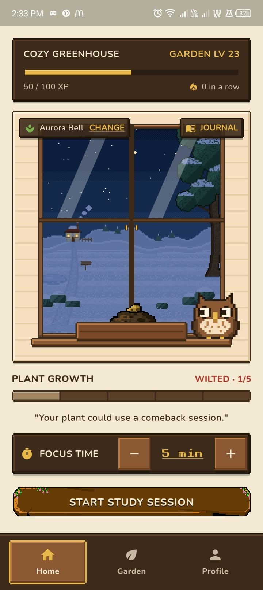
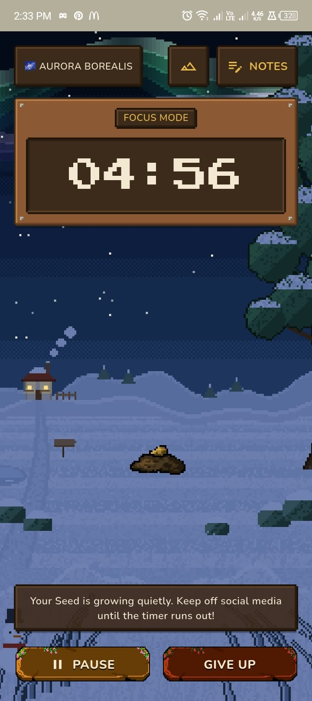
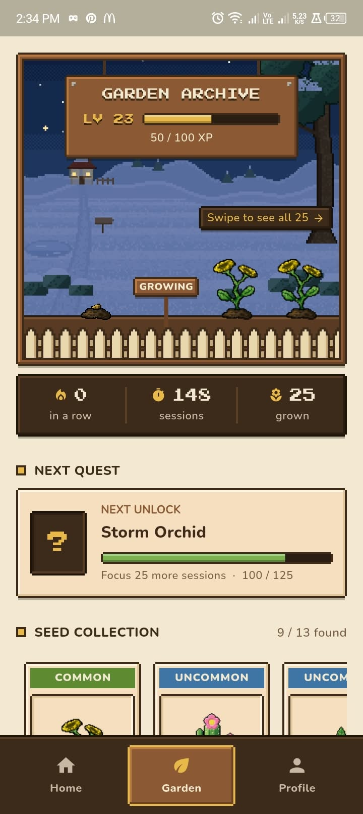
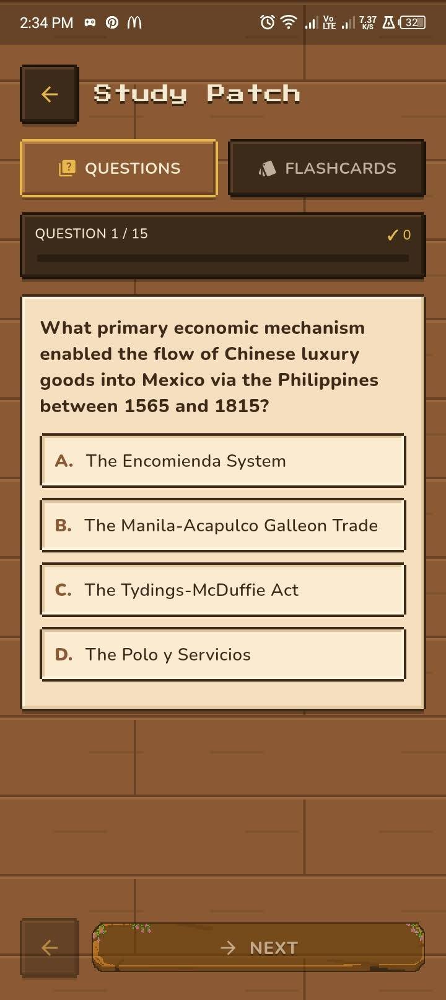
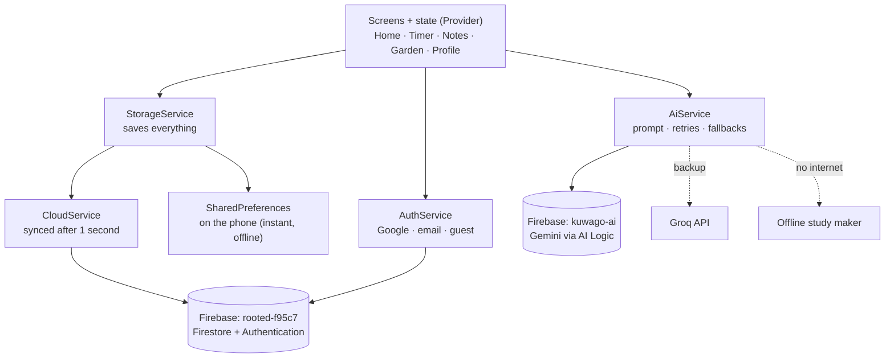

<p align="center">
  
</p>

<h1 align="center">kuwaGO</h1>

<p align="center">
  <b>A cozy pixel-art study garden — study to grow your plants.</b><br>
  Pomodoro focus timer · plant-growing game · AI flashcards and quizzes from your own notes
</p>

<p align="center">
  Flutter · Android · Firebase · Gemini
</p>

<p align="center">
  
  
  
  
</p>
<p align="center">
  <sub>Home · Focus timer · Garden · AI Study Patch</sub>
</p>

---

## What is kuwaGO?

kuwaGO is an Android app for students who study with the **Pomodoro technique**.
Every focus session you finish grows a pixel plant. Give up halfway and the
plant wilts. Fully grown plants are harvested into your garden, and new seeds
unlock as you keep studying.

While you study, you can write notes. With one tap, AI turns those notes into
**quiz questions and flashcards** so you can review what you learned (active
recall).

The mascot is **kuwago**, a pixel owl (*kuwago* is Filipino for "owl").

> Built for the **CCE106** course as *"Rooted: An AI-Assisted Pomodoro and
> Active Recall Mobile Application for Independent Student Learning."*
> The app was later renamed **kuwaGO**; the code package and Firebase project
> still use the old name `rooted`.

---

## How it works

```
 Start a focus session ─► Finish it ─► Your plant grows one stage
         │                                    │
         │ give up                            ▼ (after 4 sessions)
         ▼                              Harvest it into your garden
   Plant wilts                                │
 (next session revives it)                    ▼
                                  Earn XP · level up · unlock new seeds
```

## Features

| | Feature | What it does |
|---|---|---|
| ⏱️ | **Focus timer** | Pick your focus time and start a session. Leaving early asks if you want to give up. |
| 🌱 | **Plant growing** | 5 growth stages: seed → sprout → grow → bloom → full grown. |
| 🌻 | **13 plant species** | Unlocked by completed sessions, from the Wild Sunflower to legendary plants with glowing effects. One is secret. |
| 🏡 | **Garden** | Every plant you harvest, your stats, and your next unlock. |
| 📝 | **Study Journal** | Take notes during a session. They are saved and synced. |
| 🤖 | **AI study material** | Turns your notes into multiple choice, true/false and identification questions plus flip cards. You choose how many, the style and the difficulty. |
| 📴 | **Works offline** | No internet? A built-in maker creates simpler cards from definitions in your notes. |
| 📊 | **Study Log** | Past sessions by day, with this week's focus minutes. |
| 🏅 | **Progress** | XP, garden levels, badges, a streak, and hidden secret achievements. |
| 🎨 | **Player Card** | Profile photo, gardener name, 8 card designs and 12 garden scenes to unlock. |
| 🔔 | **Reminders** | A daily study reminder at the time you choose. |
| 👤 | **Accounts** | Sign in with Google, email, or play as a guest. Your garden syncs to the cloud. |

---

## How I built it

kuwaGO was built from **22 September to 2 October 2026**. I designed the app
and directed the work, and I used an **AI coding assistant (Claude)** as my
programming partner to turn my designs and ideas into code.

### 1. Idea and design
- I came up with the concept: a Pomodoro timer where studying grows a pixel
  garden, mixed with a cozy farming game and AI-powered active recall.
- I designed the screens in **Figma** (layout, colours and the cozy pixel
  style). These mockups were the starting point of the app.
- I drew the core pixel art by hand in **Piskel**.

### 2. Building it with AI assistance
- I sent my **Figma designs** to the AI to build the base of the app: the
  screens, navigation and pixel-style UI.
- For each feature and animation, I described what I was picturing. For
  example: *"the greenhouse window opens and zooms into the timer"*,
  *"the owl reacts when tapped"*, *"the plant wilts when I give up"*.
  The AI wrote the Flutter code, and often offered a few options. I chose
  one, tested it on my phone and asked for changes until it matched my vision.
- Animations made this way include the window-zoom transition, plant growth,
  the kuwago owl (blinking, flapping, hearts), the animated splash screen,
  the garden skies, harvest confetti and the glowing plant auras.

### 3. Setup and testing
- I set up **Firebase** in the console myself: two projects, sign-in methods,
  the Firestore database and its security rules, AI Logic and App Check.
- I tested every change on my own Android phone (itel S665L), and shared
  test builds with **14 testers** through Firebase App Distribution.
- The project has **54 automated unit tests** (`flutter test`), and
  `flutter analyze` reports no issues.
- The [`docs/`](docs) folder was kept up to date as the project grew,
  including a [decision log](docs/12-decision-log.md) of every major choice.

### Who did what

| Part | Me | AI assistant |
|---|---|---|
| App concept, features, game rules | Decided | Suggested options |
| UI design | Designed in Figma | Built it in Flutter |
| Core pixel art (Wild Sunflower, button, harvest scroll) | Drew by hand in Piskel | — |
| Other plants, wilted versions, backgrounds, app icon | Set the style, approved results | Wrote Dart scripts in `tool/` that generate them in my style |
| Animations and code-drawn art (owl, skies, confetti, auras) | Described the vision, chose and tested | Wrote the code (`CustomPainter` and animations) |
| Code | Directed, tested, asked for fixes | Wrote most of it |
| Firebase and AI setup | Did the console setup | Gave step-by-step instructions |
| Testing | Tested on my phone with 14 testers | Wrote the unit tests |

---

## Tech stack

| Part | Technology |
|---|---|
| App | [Flutter](https://flutter.dev) (Dart), Android |
| State management | `provider` (ChangeNotifier) |
| Login | Firebase Authentication (Google, email/password, anonymous guest) |
| Database | Cloud Firestore, with `shared_preferences` as an offline copy on the phone |
| AI | Gemini through **Firebase AI Logic** (`firebase_ai`), with Groq as an optional backup |
| Security | Firebase App Check (Play Integrity) and Firestore security rules |
| Notifications | `flutter_local_notifications` |
| Art | Hand-drawn pixel art (Piskel) plus code-drawn art (`CustomPainter`) |

## How the app is built



- **Screens never talk to Firebase directly.** They go through services in `lib/services/`.
- **Two Firebase projects:** the main one for login and data, and a separate one only for AI. The school account was denied Gemini access, so AI runs on a personal project.

### Database (Cloud Firestore)

| Collection | One document is | What's saved |
|---|---|---|
| `users/{uid}` | One player | Profile, progress counters, current plant, harvest log, notes, last study material, settings |
| `users/{uid}/sessions/{id}` | One study session | Finished or gave up, length, end time |

Security rule: **each user can only read and write their own documents.** See
[`firestore.rules`](firestore.rules).

### AI (Firebase AI Logic)

1. The notes and the chosen options are turned into a prompt that asks for strict JSON.
2. The request goes through **Firebase AI Logic**, which holds the Gemini key on Google's servers. There is **no Gemini API key in the app**.
3. If one Gemini model is busy or out of quota, the next one is tried.
4. Large requests are made in batches of 20, without repeats.
5. If Gemini can't answer, Groq is tried (when a key is set), then the offline maker.

---

## Getting started (developers)

### Requirements
- Flutter SDK (Dart 3)
- An Android phone or emulator
- VS Code (recommended; launch configs are included)

### 1. Install packages
```bash
flutter pub get
```

### 2. Add your local key files
These files are **git-ignored**. Never commit them.

| File | Contents | Needed for |
|---|---|---|
| `app_check.local.json` | `{"APP_CHECK_DEBUG_TOKEN": "<any UUID>"}` | AI in debug builds. Register the same UUID as an App Check debug token in Firebase. |
| `groq.local.json` | `{"GROQ_API_KEY": "<your Groq key>"}` | Optional backup AI. Without it, Groq is skipped. |

Full AI setup: [AI_SETUP.md](AI_SETUP.md).

### 3. Run
In VS Code press **F5** and choose **kuwaGO**. Or from a terminal:
```bash
flutter run --dart-define-from-file=app_check.local.json --dart-define-from-file=groq.local.json
```
Use the **kuwaGO (profile)** launch config to judge animation smoothness; debug builds are slower.

### 4. Test
```bash
flutter test
```

---

## Project structure

```
lib/
  main.dart            App start-up: Firebase, App Check, AI, loading screen
  screens/             Full pages: login, home, timer, notes, study material,
                       study log, garden, profile
  models/              App state and rules: timer, plant, notes, plant catalog,
                       XP/levels, badges, study material
  services/            Outside world: auth, Firestore, storage, AI (Gemini + Groq),
                       offline study maker, reminders
  widgets/             Reusable pixel UI: panels, buttons, dialogs, scenes, mascot
  art/                 The owl and logo as pixel grids written in code
  theme/               Colours, fonts, sizes
tool/                  Scripts that generate pixel art (dart run tool/<name>.dart)
assets/                Images: plants, backgrounds, buttons, icon
test/                  Unit tests
docs/                  Detailed project documentation
firestore.rules        Database security rules
```

---

## Roadmap

- [x] Core loop: study → grow → harvest → garden
- [x] AI study material with offline fallback
- [x] Cloud sync, Study Log, reminders, Player Card
- [x] Test builds through Firebase App Distribution
- [ ] Test and finalise the Groq backup AI
- [ ] Turn on App Check enforcement for the release app ID
- [ ] Privacy policy, in-app account deletion, Data Safety form
- [ ] Closed testing, then **Google Play Store release**

---

## Documentation

Detailed docs live in [`docs/`](docs):

| Topic | Document |
|---|---|
| Product idea, core loop, terminology | [01-product-overview](docs/01-product-overview.md) |
| Requirements and what is built | [02-requirements-current](docs/02-requirements-current.md) |
| Architecture | [06-architecture](docs/06-architecture.md) |
| Data model (Firestore, local storage, assets) | [07-data-model](docs/07-data-model.md) |
| Game rules (growth, XP, unlocks, streaks) | [08-business-rules](docs/08-business-rules.md) |
| Design system | [09-design-system](docs/09-design-system.md) |
| AI and Firebase | [10-ai-and-firebase](docs/10-ai-and-firebase.md) |
| Development workflow | [11-development-workflow](docs/11-development-workflow.md) |
| Decision log | [12-decision-log](docs/12-decision-log.md) |
| Known issues | [13-known-issues-and-tech-debt](docs/13-known-issues-and-tech-debt.md) |

Some docs were written earlier in development and may be slightly behind the code.

---

## Author

Made by **Nicho Lescano (Necko)** for CCE106.
